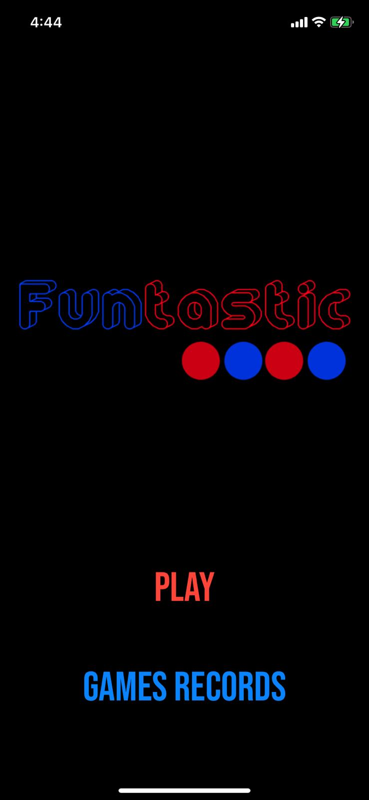
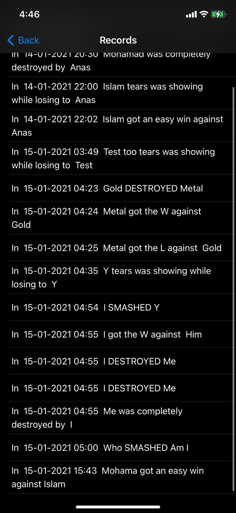
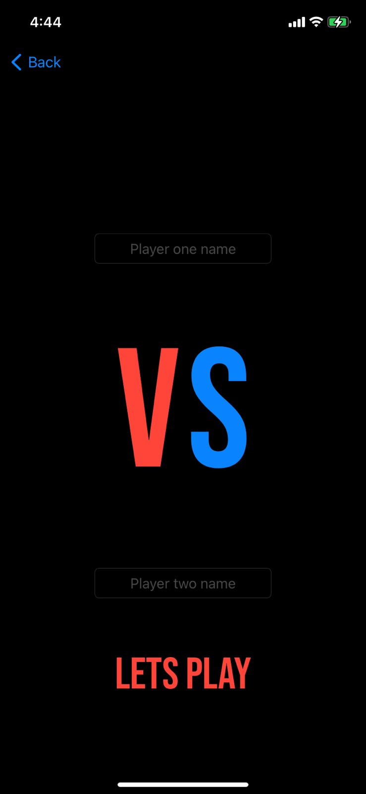
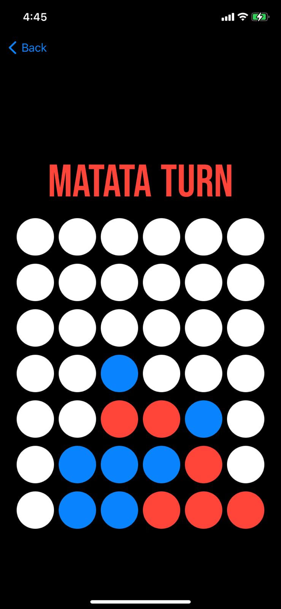

# Funtastic 4 🔴🔵
## About 📝
Funtastic 4 is 1v1 local  connect four game made in Swift using SwiftUI with some new features ,
the goal for each player is to make 4 chips align vertically ,horizontally or diagonally.

## Views 🌄
The game has four main Views : 
- Main(home)View : Contains links to other views.
- Records View : Contains list with records of older games.
- Player names View : a View that allows players to enter their names before the start of the game.
- Game View : where platers can play the game.

## Screenshots 📸

### Main(home)View

### Records View 

### Player names View 

### Game View  

## New features ✨
- The game records every game result so your friends dint deny that you DESTROYED them.
- You can share the results from the records view by long press on the recored itself.
- Cool chips sound.
- Animated loading screen.
- An easter egg.
